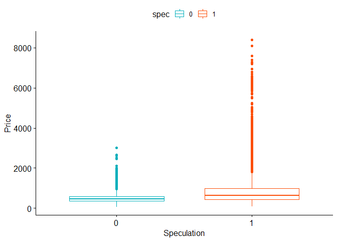
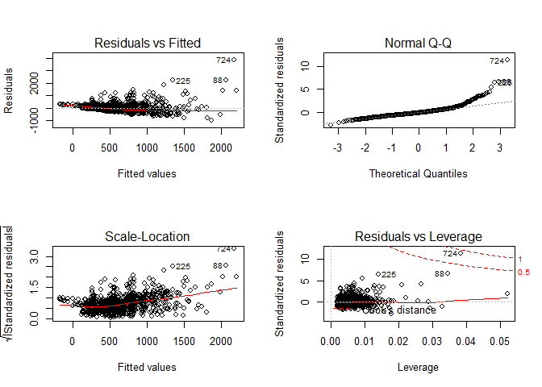
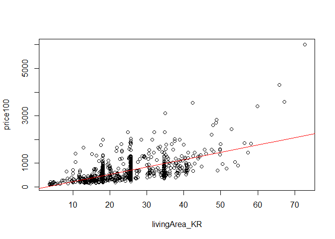
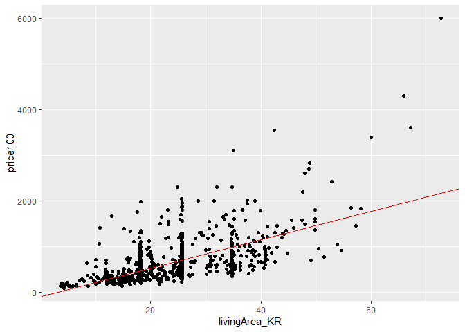
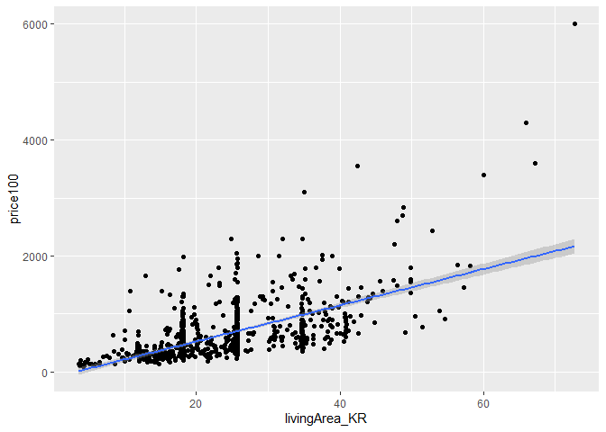
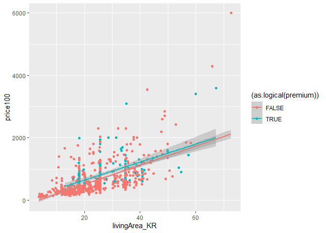
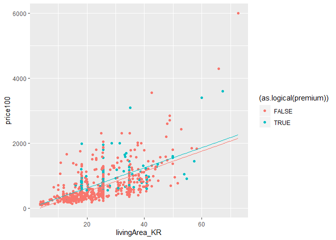

A Linear Regression Analysis on Apartment Prices in Seoul
================
연한준(한양대학교 경제금융학과 18)

last updated: 2019.07.01 15:50

About this Project
------------------

이 문서는 RMarkdown에서 작성했습니다. 해당 프로젝트는 한양대학교 <a href = "http://ctl.hanyang.ac.kr/home">R.PBL교수학습센터</a>에서 2019학년도 1학기 동안 진행한 **글로벌학습공동체:공강** 활동의 결과물입니다.

한양대학교 경제금융학과 2학년에 재학중인 4명의 학생들로 구성된 **또래오래** 팀은 `계량경제(ECO3007)` 과목에서 배운 내용을 실제 데이터에 적용, 응용해보기 위해 이 프로젝트를 진행했습니다. 해당 문서는 팀장 연한준(경금,18)이 작성했습니다.

Tools and Data
--------------

데이터 분석은 오픈소스 통계 프로그램인 R(<https://www.r-project.org/>)과 개발환경(IDE)으로는 R-Studio(<https://www.rstudio.com/>)를 이용했습니다.

부동산 데이터는 문재인 정부가 출범한 2017년 5월 이후 **2017년 6월 16일**부터 **2019년 6월 14일까지** 2년간의 서울시 아파트 매매 가격을 사용했습니다. 부동산 데이터는 `국토교통부 실거래가 공개시스템`(<http://rtdown.molit.go.kr/>)을 활용했습니다.

Initial Package Settings
------------------------

``` r
install.packages('readxl', repos = "https://cran.r-project.org/")
```

    ## Installing package into 'C:/Users/User/Documents/R/win-library/3.5'
    ## (as 'lib' is unspecified)

    ## package 'readxl' successfully unpacked and MD5 sums checked
    ## 
    ## The downloaded binary packages are in
    ##  C:\Users\User\AppData\Local\Temp\RtmpWMRpwY\downloaded_packages

``` r
library(readxl)
install.packages('ggplot2', repos = "https://cran.r-project.org/")
```

    ## Installing package into 'C:/Users/User/Documents/R/win-library/3.5'
    ## (as 'lib' is unspecified)

    ## package 'ggplot2' successfully unpacked and MD5 sums checked
    ## 
    ## The downloaded binary packages are in
    ##  C:\Users\User\AppData\Local\Temp\RtmpWMRpwY\downloaded_packages

``` r
library(ggplot2)
install.packages('tidyverse', repos = "https://cran.r-project.org/")
```

    ## Installing package into 'C:/Users/User/Documents/R/win-library/3.5'
    ## (as 'lib' is unspecified)

    ## package 'tidyverse' successfully unpacked and MD5 sums checked
    ## 
    ## The downloaded binary packages are in
    ##  C:\Users\User\AppData\Local\Temp\RtmpWMRpwY\downloaded_packages

``` r
library(tidyverse)
```

    ## -- Attaching packages ---------------------------------------------- tidyverse 1.2.1 --

    ## √ tibble  2.0.1       √ purrr   0.3.1  
    ## √ tidyr   0.8.3       √ dplyr   0.8.0.1
    ## √ readr   1.3.1       √ stringr 1.4.0  
    ## √ tibble  2.0.1       √ forcats 0.4.0

    ## -- Conflicts ------------------------------------------------- tidyverse_conflicts() --
    ## x dplyr::filter() masks stats::filter()
    ## x dplyr::lag()    masks stats::lag()

``` r
install.packages('dplyr', repos = "https://cran.r-project.org/")
```

    ## Installing package into 'C:/Users/User/Documents/R/win-library/3.5'
    ## (as 'lib' is unspecified)

``` r
library(dplyr)
install.packages('reshape2', repos = "https://cran.r-project.org/")
```

    ## Installing package into 'C:/Users/User/Documents/R/win-library/3.5'
    ## (as 'lib' is unspecified)

    ## package 'reshape2' successfully unpacked and MD5 sums checked
    ## 
    ## The downloaded binary packages are in
    ##  C:\Users\User\AppData\Local\Temp\RtmpWMRpwY\downloaded_packages

``` r
library(reshape2)
```

    ## 
    ## Attaching package: 'reshape2'

    ## The following object is masked from 'package:tidyr':
    ## 
    ##     smiths

Data Combining
--------------

##### 한번에 최대 1년치의 데이터만을 다운 받을 수 있어 2개의 파일을 병합했습니다.

##### .xlsx 파일을 불러오기 전, 데이터에 관한 설명 부분을 Excel을 이용해 삭제해 전처리 과정을 단순화했습니다.

``` r
library(readxl)
data18 <- read_excel('아파트(매매)_실거래가_201706-201806.xlsx')
data19 <- read_excel('아파트(매매)_실거래가_201806-201906.xlsx')
datac<-rbind(data18,data19)
```

Data Labeling
-------------

``` r
library(dplyr)
## '시군구'라는 한개의 변수로 저장된 데이터를 서울시에 맞춰 각각 '시' '구' '동'의 변수로 분할
datas<-separate(datac, col=시군구, sep=' ', into=c('시','구','동'))

## 한글로 저장된 변수를 간단한 영어로 변환
ym<-datas$계약년월
si<-datas$시
gu<-datas$구
dong <- datas$동
bunji <- datas$번지
danji <- datas$단지명

## string(문자형)으로 저장된 변수를 numeric(숫자형)으로 변환
floor <- datas$층
floor <- as.numeric(floor)
const_year <- datas$건축년도
const_year <- as.numeric(const_year)
livingArea <- datas$`전용면적(㎡)`
livingArea <- as.numeric(livingArea)

## 제곱미터로 표현된 전용면적을 평 단위로 변환
livingArea_KR <- livingArea/3.30579

## 1) 변수 이름 변경
price<-datas$`거래금액(만원)`
## 2) 천단위 마다 표시된 콤마 삭제
pricey<-gsub(",","", price)
## 3) 문자형 변수로 변환
price<- as.numeric(pricey)
## 4) 단위를 만원에서 백만원 단위로 변환
price100<-price/100
price100
```

Data Formatting
---------------

``` r
## 문자형으로 저장된 거래년월 데이터를 숫자형으로 변환
ym<-as.numeric(ym)
## 년과 월 사이에 '-' 삽입
ymDate<-gsub('^(.{4})(.*)$', '\\1-\\2', ym)
## 계약일 변수를 숫자형으로 변환
day<-as.numeric(datas$계약일)
## 계약년월과 일 변수를 '-'로 이어 새로운 변수 생성
ymd = paste(ymDate,day,sep="-")
## 숫자형 변수를 날짜 형태로 변환
ymd_date<- as.Date(ymd)

## 계약 날짜, 시, 구, 동, 아파트 번지, 단지, 층수, 건축년도, 전용면적, 가격으로 구성된 새로운 2차원 구조의 data.frame 생성
houseData = data.frame(ymd_date, si, gu, dong, bunji, danji, 
                       floor, const_year, livingArea_KR, price100)
```

Speculation Labeling
--------------------

#### 문재인 정부 출범(2017년 5월 이후) 첫 대규모 부동산 대책인 **8.2 부동산 대책** <a href = "http://www.molit.go.kr/USR/NEWS/m_71/dtl.jsp?id=95079498">(국토교통부 보도자료)</a> 의 핵심인 `투기지역` 과 `투기과열지구` 지정에 따른 서울시 아파트 매매가격의 변화 및 차이를 분석했습니다.

###### 투기지역과 투기과열지구 선정에 따른 각각의 정책은 보도자료에서 확인할 수 있습니다.

``` r
## 서울시 전역이 투기과열지구로 지정
## 투기지역은 전체 25개 구 중 해당 11개에 해당
spec<-ifelse(houseData$gu=='강남구'|houseData$gu=='서초구'|houseData$gu=='송파구'
                       |houseData$gu=='강동구'|houseData$gu=='용산구'|houseData$gu=='성동구'
                       |houseData$gu=='노원구'|houseData$gu=='마포구'|houseData$gu=='양천구'
                       |houseData$gu=='영등포구'|houseData$gu=='강서구',1,0)
## 기존의 data.frame에 투기지역 선정 여부 변수(더미변수) 추가
houseData = data.frame(ymd_date, si, gu, dong, bunji, danji, 
                       floor, const_year, livingArea_KR, price100, spec)
## data.frame의 구조 열람
str(houseData)
```

    ## 'data.frame':    146566 obs. of  11 variables:
    ##  $ ymd_date     : Date, format: "2017-07-08" "2017-07-23" ...
    ##  $ si           : Factor w/ 1 level "서울특별시": 1 1 1 1 1 1 1 1 1 1 ...
    ##  $ gu           : Factor w/ 25 levels "강남구","강동구",..: 1 1 1 1 1 1 1 1 1 1 ...
    ##  $ dong         : Factor w/ 327 levels "가락동","가리봉동",..: 9 9 9 9 9 9 9 9 9 9 ...
    ##  $ bunji        : Factor w/ 5213 levels "1","1-1","1-10",..: 3820 3834 3834 3834 3834 3834 3834 3834 3834 3834 ...
    ##  $ danji        : Factor w/ 6061 levels "(1-102)","(1101-1)",..: 376 377 377 377 377 377 377 377 377 377 ...
    ##  $ floor        : num  1 3 1 3 4 5 4 2 1 2 ...
    ##  $ const_year   : num  1988 1987 1987 1987 1987 ...
    ##  $ livingArea_KR: num  23.5 24.2 16.6 24.2 24.2 ...
    ##  $ price100     : num  899 1175 900 1240 1235 ...
    ##  $ spec         : num  1 1 1 1 1 1 1 1 1 1 ...

#### 투기지역(=1)과 투기조정지역(=0)의 아파트 매매가격 차이

``` r
install.packages('ggpubr', repos = "https://cran.r-project.org/")
```

    ## Installing package into 'C:/Users/User/Documents/R/win-library/3.5'
    ## (as 'lib' is unspecified)

    ## package 'ggpubr' successfully unpacked and MD5 sums checked
    ## 
    ## The downloaded binary packages are in
    ##  C:\Users\User\AppData\Local\Temp\RtmpWMRpwY\downloaded_packages

``` r
library(ggpubr)
```

    ## Loading required package: magrittr

    ## 
    ## Attaching package: 'magrittr'

    ## The following object is masked from 'package:purrr':
    ## 
    ##     set_names

    ## The following object is masked from 'package:tidyr':
    ## 
    ##     extract

``` r
ggboxplot(houseData, x='spec', y='price100',
          color='spec', palette = c("#00AFBB", "#FC4E07"),
          xlab='Speculation', ylab='Price')
```



Apartment Branding
------------------

#### 아파트 브랜드가 가격에 미치는 영향 분석

##### 아파트 선호 브랜드 상위 10개는 `2018년 베스트 아파트 브랜드 설문조사` (부동산114, 한국리서치. 2018.11. 성인 남녀 5049명 대상)

``` r
houseData <- mutate(houseData, premium = ifelse(grepl('래미안|편한세상|푸르지오|자이|더샵|
                     힐스테이트|롯데캐슬|아이파크|위브|VIEW', houseData$danji),1,0))
## 전체 아파트 매매 데이터 중 고급 브랜드에 해당하는 건수: 23,545
## 전체 아파트 매매 데이터 건수: 146,566

#### 15만개에 달하는 매매가격 데이터를 처리할 컴퓨팅 능력이 부족해 단순 무작위 비복원추출을 사용해 데이터를 경량화했습니다.
houseDataSample <- sample_n(houseData, 1000)
```

Interactive Bubble Chart
------------------------

#### 지역구에 따른 아파트 건설년도를 시각화해보았습니다. 2017년부터 2019년에 거래된 아파트는 대체적으로 1990년에서 2010년 사이 지어진 아파트가 많다는 것을 볼 수 있습니다.

``` r
install.packages('plotly', repos = "https://cran.r-project.org/")
```

    ## Installing package into 'C:/Users/User/Documents/R/win-library/3.5'
    ## (as 'lib' is unspecified)

    ## package 'plotly' successfully unpacked and MD5 sums checked
    ## 
    ## The downloaded binary packages are in
    ##  C:\Users\User\AppData\Local\Temp\RtmpWMRpwY\downloaded_packages

``` r
library(plotly)
```

    ## 
    ## Attaching package: 'plotly'

    ## The following object is masked from 'package:ggplot2':
    ## 
    ##     last_plot

    ## The following object is masked from 'package:stats':
    ## 
    ##     filter

    ## The following object is masked from 'package:graphics':
    ## 
    ##     layout

``` r
bub <- plot_ly(houseDataSample, x = ~const_year, y = ~gu, text = ~price100, 
               type = 'scatter', mode = 'markers')
bub
```

    ## PhantomJS not found. You can install it with webshot::install_phantomjs(). If it is installed, please make sure the phantomjs executable can be found via the PATH variable.

<!--html_preserve-->

<script type="application/json" data-for="htmlwidget-9829dad97ac64b107076">{"x":{"visdat":{"21f8261347cb":["function () ","plotlyVisDat"]},"cur_data":"21f8261347cb","attrs":{"21f8261347cb":{"x":{},"y":{},"text":{},"mode":"markers","alpha_stroke":1,"sizes":[10,100],"spans":[1,20],"type":"scatter"}},"layout":{"margin":{"b":40,"l":60,"t":25,"r":10},"xaxis":{"domain":[0,1],"automargin":true,"title":"const_year"},"yaxis":{"domain":[0,1],"automargin":true,"title":"gu","type":"category","categoryorder":"array","categoryarray":["강남구","강동구","강북구","강서구","관악구","광진구","구로구","금천구","노원구","도봉구","동대문구","동작구","마포구","서대문구","서초구","성동구","성북구","송파구","양천구","영등포구","용산구","은평구","종로구","중구","중랑구"]},"hovermode":"closest","showlegend":false},"source":"A","config":{"showSendToCloud":false},"data":[{"x":[2009,2002,2001,2001,1982,2015,1995,1988,2003,1993,2010,1993,2014,2014,2008,1991,2016,1990,1998,1989,1999,2001,1997,1996,2013,2008,2004,1988,2003,2011,2003,1983,1998,1993,2009,2000,1989,2001,1997,1988,2015,2003,2016,1996,2000,1998,2003,1999,2003,1982,2004,1996,2015,1992,2000,2003,1999,2010,2005,1995,2005,1998,1986,1986,2005,1996,1987,2001,2001,2007,2010,2008,1982,2004,1988,2015,1988,2000,1994,2005,1983,1994,1993,2017,1986,2012,2005,2011,1996,2009,1996,1988,1996,2001,1999,1988,2008,1998,2008,2001,1997,1997,2001,2011,2003,1997,2004,2003,2006,1986,2009,2001,2016,1999,1974,2006,1997,2005,2002,2003,1997,2003,2000,2016,1999,2000,1993,1974,1985,2002,2017,1985,2004,2008,1997,1995,1987,2009,2001,2014,2002,1979,1986,1990,2009,1995,2003,2000,1992,2010,2011,2016,1991,1994,1994,1992,1989,2009,1988,1988,2003,1992,1992,2005,2006,2015,1988,2003,1997,2004,1986,2012,1987,1982,2001,2015,2000,2004,1982,2018,2000,1992,1989,2013,1999,1989,1999,1984,1998,1988,2010,2010,2004,2000,2003,2003,1993,1987,1997,1986,2012,1998,1992,2005,2003,1970,1997,2009,2003,2010,1992,1994,2006,1996,2006,1996,2004,1991,1988,1990,1977,2003,2005,1985,1973,2011,2002,2000,2003,2017,2015,2008,1996,2005,2009,2014,2001,2016,1990,1988,2013,1999,2013,2014,2005,1974,1997,2007,2013,1990,1988,2001,1993,1995,1987,1999,1976,2008,1987,2001,1994,2006,2010,2005,1997,2016,2011,2004,1988,2001,2014,2017,1999,2000,2003,2013,2003,2010,1995,1994,2000,1987,1987,1992,1978,2000,1987,1983,1984,2014,1999,2017,1979,2006,1986,2008,2014,2004,1989,1989,2015,1989,2004,2010,2010,2004,1999,2007,2007,1974,2003,2004,1983,2003,1992,2003,1986,2010,2011,2011,1992,2007,2004,2014,1993,1994,1987,2003,2004,2003,2004,1978,2007,1992,2003,1996,2011,2008,2013,2003,2012,2008,1996,2003,2016,2010,1975,1988,2011,1996,2003,1984,2006,2014,1992,1982,2002,1994,2018,2008,2003,2006,2003,2014,1988,1986,2002,2006,2010,1978,1988,2001,2010,1997,2001,1995,1999,2003,1989,1998,1987,2015,2004,1986,1997,2001,1991,2005,1994,1997,1989,2003,1988,1989,1984,2004,1995,1999,2006,1999,2000,2001,2001,2009,2005,1991,1997,2003,1977,2001,2010,2005,2002,1986,2007,1990,2001,2011,1976,1988,2008,2001,2010,2016,2000,2001,1985,1992,2018,2009,2000,2004,1975,1987,2015,1994,2003,1997,2002,1990,1999,2005,2014,2001,2000,1999,1998,1986,1979,1978,1996,1986,2008,2016,2000,1992,1995,2004,2006,2010,1986,1998,2014,2000,2004,1988,1984,1990,1997,2008,1988,2001,2004,1998,2000,2015,1982,1989,2004,2000,1995,2002,1994,2007,1995,2002,1998,1999,2018,2003,1997,1999,2011,1992,2006,1992,1980,2016,1987,2002,2004,1992,2004,2003,1998,1985,1985,2008,2010,2004,1997,2017,2009,2008,1999,2010,1989,2008,1987,2011,1998,2014,1994,2008,2013,2012,1992,1999,2003,1997,2013,1995,2016,2009,2004,2014,1999,1994,2003,1989,1999,2006,1995,2005,2011,1992,2002,1998,1998,1998,2000,2000,2012,2013,1975,1996,2015,1983,1995,1989,2008,2004,1991,2000,2013,2009,2005,2004,1979,1988,1999,2005,2001,2000,1993,1978,2003,2014,1997,2003,1987,2004,2000,2009,2012,1988,2014,2018,1993,2008,1999,1994,2015,1992,2003,2012,2004,1996,2005,1983,2011,1987,2000,1989,1993,2002,1988,1999,1999,2010,2003,2008,2004,1990,1988,1999,2011,2011,2003,1994,2011,1999,1999,2016,2014,2004,1998,2003,2000,1987,1993,2003,2000,2014,1998,1997,2010,1998,2013,1999,1998,2007,1998,1992,2011,1993,1993,2010,2000,1989,2004,2003,2014,2008,2012,2005,1986,1988,1996,1993,1990,1993,2007,1987,2010,1995,2006,1975,2001,2004,1981,2003,1993,2004,1978,1990,2004,1999,2000,2015,1994,2001,1992,2011,2004,2008,2001,2011,1992,2009,2008,1986,2000,1995,1991,2006,2004,2007,2003,2013,1991,2012,2001,2016,2010,2014,2011,2011,2012,2008,2008,1996,2005,2007,2006,1983,1992,2000,1994,2013,2013,2006,2009,2011,2003,2006,1989,1998,2013,2003,2009,2007,2012,1999,2003,1992,1998,2001,1982,2008,2005,1980,2001,2015,2007,2003,2017,2002,1988,1993,1993,2007,2013,1987,1997,2006,1994,1992,2014,2008,2005,2014,2008,1999,2008,1993,2006,2003,1990,1997,1991,1983,1991,2004,1989,2009,2001,2013,1998,1990,1992,1978,1994,1989,2007,2014,2004,2002,2003,2007,2001,1988,2007,1991,2003,2014,1988,2000,1990,1999,2003,2001,1983,1988,2018,2003,2004,1997,2014,1980,1986,1996,2015,2002,2000,2002,1998,1976,2000,2003,2017,1969,1999,1996,2004,2005,1999,1996,1971,1992,1989,2004,1993,1996,1999,2006,1995,1997,2002,1997,1974,2008,2015,2003,1988,2003,2015,1995,2003,2004,2015,1999,1995,1988,2003,1987,2015,2006,1994,2001,2016,2010,2003,2010,1996,2014,1999,2006,2005,2012,2001,1999,2008,2003,1996,2006,1984,1997,2008,2008,1996,1979,2005,2007,1998,2016,2000,1991,1988,2002,1998,2010,2003,1988,2000,2003,2016,1998,1995,1988,2006,1993,1986,2014,1995,1999,2005,2010,1999,1992,2003,1999,2014,2012,1998,1971,2003,2004,2000,1991,2016,1999,2002,2003,2003,2004,1988,1996,2000,1982,2014,2004,2013,2003,1999,2007,1985,2002,2014,2015,2010,1997,2005,2003,1995,1991,2001,1993,2004,1987,1996,2003,2013,2009,1986,2001,2004,1978,2012,2005,2000,2006,2000,2008,2010,2005,1995,1989,2004,1999,1982,1986,2002,1988,1999,2007,1983,2010,2011,2003,1992,1997,2011,2003,1984,2000,1987,2000,2014,1992,1988,1984,2004,2002,1989,2011,2003,1991,1994,2001],"y":["노원구","서초구","성동구","양천구","강동구","송파구","성동구","양천구","성북구","영등포구","성북구","강남구","영등포구","강서구","성북구","노원구","강동구","동작구","영등포구","성동구","강동구","중구","중랑구","중랑구","강서구","양천구","용산구","도봉구","관악구","용산구","성북구","강동구","노원구","강남구","성북구","구로구","노원구","동대문구","노원구","관악구","서초구","서초구","마포구","광진구","관악구","노원구","성북구","노원구","마포구","강동구","성동구","노원구","강서구","양천구","노원구","관악구","구로구","성북구","서대문구","중랑구","강서구","서대문구","도봉구","도봉구","성북구","도봉구","도봉구","노원구","성동구","구로구","은평구","강서구","강남구","성북구","노원구","서대문구","은평구","마포구","강서구","노원구","강남구","서초구","노원구","강서구","성동구","중구","성동구","성동구","구로구","관악구","중랑구","동작구","중랑구","동작구","구로구","노원구","강서구","성북구","송파구","용산구","동작구","송파구","영등포구","성북구","성동구","송파구","은평구","서초구","관악구","양천구","동대문구","강동구","양천구","강서구","관악구","양천구","영등포구","영등포구","서초구","중랑구","동작구","동대문구","노원구","마포구","종로구","광진구","강서구","관악구","강동구","은평구","성동구","강남구","관악구","송파구","중랑구","도봉구","노원구","은평구","성동구","동대문구","서초구","강남구","구로구","동작구","노원구","노원구","강북구","노원구","관악구","동작구","송파구","서대문구","노원구","강서구","서대문구","영등포구","노원구","성동구","노원구","송파구","마포구","중랑구","서대문구","마포구","양천구","광진구","노원구","서초구","노원구","종로구","구로구","서대문구","구로구","강남구","은평구","서대문구","송파구","서초구","영등포구","동대문구","동대문구","강서구","노원구","용산구","성북구","노원구","영등포구","송파구","성북구","도봉구","동작구","중구","은평구","양천구","성북구","서초구","중랑구","광진구","영등포구","노원구","영등포구","용산구","송파구","서초구","서초구","마포구","도봉구","구로구","구로구","성북구","노원구","노원구","강남구","강동구","강북구","마포구","서초구","도봉구","송파구","도봉구","영등포구","관악구","강동구","강동구","서초구","성북구","양천구","강동구","송파구","은평구","성동구","양천구","강동구","노원구","서초구","금천구","동대문구","광진구","노원구","양천구","중랑구","구로구","종로구","동대문구","강서구","서초구","은평구","용산구","강서구","노원구","노원구","용산구","노원구","송파구","노원구","구로구","서초구","성북구","서대문구","송파구","서초구","강남구","양천구","송파구","영등포구","동작구","마포구","강남구","송파구","서대문구","강남구","강동구","광진구","금천구","관악구","은평구","성북구","강북구","중랑구","구로구","관악구","서초구","노원구","강동구","서초구","강동구","노원구","강동구","강남구","동대문구","강서구","강동구","서초구","구로구","도봉구","은평구","강서구","강서구","노원구","노원구","강남구","노원구","관악구","은평구","성북구","광진구","강남구","성북구","송파구","서대문구","성북구","강서구","강동구","마포구","노원구","동대문구","노원구","마포구","마포구","마포구","동대문구","관악구","강북구","강서구","강남구","중랑구","강남구","동작구","송파구","은평구","도봉구","관악구","동대문구","동대문구","송파구","강동구","중구","중구","은평구","서초구","강서구","송파구","중랑구","성북구","마포구","은평구","서대문구","노원구","은평구","관악구","용산구","송파구","광진구","은평구","종로구","강남구","서초구","동작구","동대문구","관악구","구로구","성북구","동대문구","마포구","노원구","구로구","강남구","서초구","성북구","서초구","동작구","서대문구","성북구","양천구","용산구","노원구","노원구","동대문구","은평구","영등포구","구로구","서대문구","금천구","양천구","송파구","구로구","도봉구","강서구","노원구","은평구","동대문구","강서구","노원구","강서구","노원구","도봉구","강서구","강서구","중랑구","종로구","관악구","성북구","영등포구","서초구","성북구","강북구","강북구","동작구","강남구","동대문구","동대문구","노원구","송파구","도봉구","구로구","양천구","동작구","성북구","강남구","양천구","중구","용산구","동작구","성동구","은평구","동대문구","서대문구","광진구","서대문구","영등포구","양천구","동작구","중랑구","노원구","은평구","강서구","성북구","강서구","광진구","도봉구","영등포구","관악구","구로구","서대문구","강북구","구로구","관악구","마포구","강남구","송파구","마포구","노원구","강동구","노원구","성동구","도봉구","구로구","광진구","강서구","은평구","성동구","성북구","구로구","영등포구","도봉구","노원구","강동구","도봉구","노원구","강서구","도봉구","성동구","구로구","중랑구","성동구","은평구","강남구","노원구","강북구","노원구","도봉구","동대문구","강동구","송파구","강서구","관악구","강남구","성동구","동대문구","은평구","강동구","성북구","강북구","강서구","중랑구","노원구","강동구","강동구","노원구","마포구","마포구","도봉구","강북구","마포구","구로구","양천구","송파구","양천구","동작구","성북구","강북구","마포구","서초구","관악구","구로구","성북구","금천구","강동구","도봉구","동대문구","마포구","동대문구","강남구","송파구","강남구","성북구","강남구","중구","동대문구","양천구","강동구","성동구","도봉구","강동구","관악구","마포구","도봉구","양천구","도봉구","노원구","강서구","동대문구","도봉구","구로구","영등포구","강북구","마포구","노원구","서대문구","동작구","금천구","영등포구","성동구","송파구","영등포구","중랑구","송파구","송파구","강남구","강동구","송파구","금천구","금천구","중랑구","중랑구","서초구","도봉구","양천구","서초구","양천구","성북구","영등포구","성동구","양천구","강북구","서초구","강남구","영등포구","송파구","서초구","도봉구","마포구","마포구","서초구","광진구","도봉구","중랑구","은평구","영등포구","송파구","강동구","용산구","강서구","강서구","서초구","송파구","동작구","성동구","강남구","노원구","강동구","노원구","동대문구","구로구","노원구","관악구","도봉구","동작구","서대문구","은평구","강서구","강남구","중랑구","영등포구","노원구","성동구","구로구","은평구","강동구","성북구","서대문구","노원구","서대문구","강동구","마포구","도봉구","동작구","마포구","동대문구","구로구","동작구","성북구","관악구","강서구","노원구","영등포구","구로구","도봉구","서초구","영등포구","노원구","성동구","서대문구","강서구","은평구","광진구","강북구","동대문구","은평구","구로구","송파구","성북구","영등포구","관악구","마포구","성북구","강동구","송파구","마포구","동작구","노원구","강서구","강서구","노원구","강북구","송파구","광진구","중구","구로구","강남구","송파구","강북구","도봉구","서초구","영등포구","노원구","금천구","성북구","성동구","관악구","강서구","동대문구","서초구","양천구","양천구","송파구","구로구","성북구","노원구","강동구","종로구","양천구","관악구","도봉구","영등포구","구로구","강서구","성동구","마포구","동작구","노원구","강남구","마포구","동작구","은평구","양천구","서대문구","구로구","성동구","은평구","송파구","중랑구","강서구","성북구","서대문구","강남구","강남구","중랑구","강서구","서초구","강서구","광진구","서대문구","용산구","구로구","동작구","은평구","노원구","강남구","서초구","서초구","중랑구","송파구","구로구","동대문구","노원구","종로구","동작구","강남구","중구","관악구","강동구","용산구","동작구","송파구","노원구","강동구","강동구","양천구","도봉구","노원구","광진구","강동구","양천구","송파구","송파구","성동구","강남구","금천구","송파구","노원구","영등포구","성북구","영등포구","관악구","관악구","서초구","강남구","중랑구","송파구","도봉구","강남구","노원구","관악구","노원구","동작구","서초구","종로구","노원구","노원구","도봉구","강남구","중랑구","노원구","성북구","금천구","강남구","도봉구","성북구","송파구","양천구","노원구","성북구","노원구","서초구","강서구","도봉구","마포구","노원구","성북구","마포구","강서구","강동구","노원구","용산구","성북구","성북구","구로구","중랑구","강동구","강동구","마포구","서초구","노원구","관악구","도봉구","강서구","영등포구","양천구","강동구","동대문구","용산구","중구","광진구","강북구","성북구","강동구","중랑구","관악구","강남구","금천구","성북구","강서구","중랑구","영등포구","강북구","중랑구","도봉구","강서구","영등포구","관악구","은평구","강서구","양천구","노원구","성동구","강남구","노원구","관악구","동작구","강서구","중구","강서구","송파구","성동구","양천구","강서구","강북구","성동구","성동구","강동구","중구","성북구","은평구","도봉구","광진구","강서구","송파구","양천구","관악구","구로구","구로구","송파구","마포구","강남구","강남구","강동구","성동구","은평구","강서구","송파구","강남구","관악구","광진구","양천구","서초구","동대문구","노원구","노원구","양천구","구로구","중랑구","양천구","노원구","구로구","강남구","서대문구","강동구","노원구","송파구","양천구","동작구","영등포구","중랑구","송파구","구로구","성북구","중랑구","강동구","강남구","강동구","서대문구","영등포구","동대문구","영등포구","영등포구","중랑구","서대문구","동대문구","노원구","강동구","마포구","마포구","강동구","강남구","마포구","양천구","관악구","노원구","서초구","금천구","금천구","용산구","영등포구","광진구","송파구","서대문구","서대문구","강남구","은평구","성북구","서대문구","서초구","강서구","광진구","서초구","동작구","서초구","동대문구","양천구","광진구","영등포구","강동구","서대문구","영등포구","중구","강동구","서초구","성동구","송파구","성동구","은평구","관악구","성북구","영등포구","양천구","강서구","구로구","성북구","노원구","강동구","도봉구","도봉구","도봉구","중구","양천구","강남구","마포구","서초구","성북구","강서구","송파구","은평구","성북구","구로구","관악구","광진구","구로구","성동구","강서구","노원구","영등포구","서초구","양천구","도봉구","중구","서대문구","강북구","강서구","도봉구"],"text":[420,600,840,400,448,1440,680,600,628,590,569,1245,694,875,678,375,900,690,350,700,870,470,420,410,925,473,700,520,490,1245,234,915,177.5,880,600,860,195,418,450,257.5,800,1800,1190,530,481,225,520,352.5,1200,550,549,710,113,540,305,580,770,637,560,447,823,500,275,175,530,232,177.5,465,428,650,595,690,1390,388,330,810,395,800,377,395,1330,650,370,920,650,950,685,4300,193,493,298,900,319,460,480,440,540,360,1120,1050,645,600,1350,696.95,710,440,244,309,490,1120,730,298,510,600,264,508,595,960,675,450,598,409,315,1100,598,720,690,250,780,299,942.41,2300,480,1350,365,459,388,780,590,709,460,1200,469,1030,400,185,420,350,607,850,645,480,400,393,505,378,200,700,240,1830,550,397,248,785,870,276,410,650,485,1300,506,700,192,1400,285,722,585,1570,470,243,410,598,279,200,458,200,247.5,795,530,253,800,1350,329,1200,487,260,274,685,670,365,129,1300,505,1000,1600,480,699,430,512.5,530,205,210,1875,400,468,380,1300,268,1440,339,938,492,347.5,670,3550,715,1015,565,795,370,188,230,370,399,1555,130,560,575,290,210,450,325,137,820,300,1650,420,1600,115,235,310,700,592,540,243,395,1108,437,255,677,755,1295,686.5,1400,420,164.5,885,1250,1260,855,1470,260,470,355,480,343,340,540,520,375,470,1230,230,520,1500,559,407,450,2000,723,445,280,1545,381,420,777,1060,648,520,310,1950,213,580,605,640,1360,890,530,1040,265,764,900,670,655,350,680,337.5,670,1185,595,283,450,430,1068,1180,458,1590,570,919,425,590,270,680,413,905,485,1050,688,775,1550,104,795,310,370,1264,670,255,325,430,518,820,780,680,288,529,1665,1000,530,327,405,428,849,426,1170,340,170,2430,1275,540,1785,495,540,620,570,890,411,285,600,403,403,290,715,417,1300,920,460,307,800,220,379,320,1050,350,370,237,180,490,535,437,750,548,392,550,3400,500,460,358,550,2300,460,775,349.8,630,315,545,750,540,596,2700,260,580,820,580,1272,390,380,330,720,635,780,264,647,140,188,730,594,395,410,890,288,473,713,520,555,420,730,437,515,1540,1800,545,395,570,470,460,310,430,665,560,725,900,465,527,550,345,312,700,297,590,549,290,1000,655,290,577,538,1055,350,435,675,408,485,725,875,513,660,1050,553,360,470,504,429,560,393,435,220,970,1150,360,400,900,449,407.5,1057,343,860,1197,395,780,397,250,1200,3600,550,350,640,285.5,675,175,770,637,705,1290,640,960,1020,630,770,479,875,121,443,249,585,405,892,270,743,240,520,570,515,230,386,107,383,435,745,600,720,348,695,955,730,1200,200,1130,820,1230,430,2020,470,360,421,120,1800,460,290,2300,750,562,1450,530,550,364,1785,1180,500,730,440,280,400,445,3100,1000,260,409,453,464,653,420,850,630,500,1695,703,700,739,1200,281,898,420,487,295,870,410,223,429,540,645,553,1700,324,319,350,1020,397,540,380,448,830,355,575,1000,810,385,639,560,395,520,450,458,540,1100,345,580,595,410,930,561,230,805,600,299,495,870,290,728,404,350,950,413,440,580,1450,475,919,1210,615,715,385,494,760,244,502,600,810,320,289,1245,1250,253,305,1650,1250,362,380,350,700,460,358,555,1860,515,718,1290,550,630,185,568,520,745,340,300,502,545,478,700,748,870,305,740,600,640,570,410,658,164,900,600,1940,325,500,440,313.5,2600,699,439,325,935,94.5,755,475,6000,495,480,340,375,880,355,1990,472,985,306,525,297,470,540,1760,890,630,1285,850,210,730,407,450,520,820,370,600,1127,160,1480,710,705,599,1590,578,975,605,657,455,550,419,320,610,357,214,899,290,2840,237,537,323,595,1850,138,490,247,375,890,360,360,440,540,2200,362,470,1300,420,398,558,485,410,840,374,530,248,334,645,210,675,320,358,469,428,387,430,1300,1000,590,1100,495,407,490,415,1572,323,875,327,235,680,950,465,500,420,240,165,710,350,498,299,241,950,450,600,519.5,400,565,400,370,890,330,410,805,2000,350,520,410,1100,990,668,1250,810,1449.5,622,498,710,740,850,814,346,450,230.5,493,410,369,310,127,545,610,700,785,290,329,800,805,615,577,900,1490,677,1180,890,2000,500,268,320,417,380,439,440,600,620,1195,1070,500,210,1800,313,320,475,456.5,750,850,589,599,399,560,600,660,693,700,425,1580,210,340,365,243,900,1065,600,980,790,990,772,530,501,1100,555,375,1280,1230,550,1290,487,580,1047,775,955,328,815,405,799,960,650,980,550,215,720,899,112,490,450,900,625,1395,830,940,783,390,520,700,900,290,500,440,425,310.5,590,259,350,138,460,369,2040,600,1000,570,300,400,540,610,387,395,550,625,995,259,258,790,670,432,340,690,440,350,374,440],"mode":"markers","type":"scatter","marker":{"color":"rgba(31,119,180,1)","line":{"color":"rgba(31,119,180,1)"}},"error_y":{"color":"rgba(31,119,180,1)"},"error_x":{"color":"rgba(31,119,180,1)"},"line":{"color":"rgba(31,119,180,1)"},"xaxis":"x","yaxis":"y","frame":null}],"highlight":{"on":"plotly_click","persistent":false,"dynamic":false,"selectize":false,"opacityDim":0.2,"selected":{"opacity":1},"debounce":0},"shinyEvents":["plotly_hover","plotly_click","plotly_selected","plotly_relayout","plotly_brushed","plotly_brushing","plotly_clickannotation","plotly_doubleclick","plotly_deselect","plotly_afterplot"],"base_url":"https://plot.ly"},"evals":[],"jsHooks":[]}</script>
<!--/html_preserve-->
Linear Regression
-----------------

#### 1.대지면적(평수) 2.투기지역 선정 여부 3.건설시기 4.층수 5.선호되는 아파트인지의 여부 의 총 5개의 변수가 아파트 가격에 미치는 영향을 선형회귀모형으로 분석했습니다.

#### 선형회귀분석은 종속변와 독립변수들 간의 선형관계를 나타내는 식으로 다음과 같은 형태로 표현됩니다: 
*y*<sub>*i*</sub> = *α* + *β*<sub>1</sub>*x*<sub>*i*</sub>1 + ... + *β*<sub>*p*</sub>*x*<sub>*i*</sub>*p* + *ϵ*<sub>*i*</sub>, *i* = 1, ..., *n*

##### 선형회귀분석에 대한 간략한 설명은 <a href = "https://blog.naver.com/istech7/50152984368">여기</a>에서 보실 수 있습니다.

``` r
model1 <- lm(price100 ~ livingArea_KR + spec + const_year + floor + premium
             ,data=houseDataSample)

## 각 변수의 단위가 1만큼 증가할 때 평균적으로 변하는 아파트 가격
## ex) floor: 아파트 층수가 한단위 높아지면 평균적으로 매매가는 4.891백만원 증가한다.
model1$coef[1]
```

    ## (Intercept) 
    ##    3438.826

``` r
## 회귀분석으로 출력된 각 변수들의 영향력(coefficient)의 신뢰치
## 건설년도(const_year)를 제외한 모든 변수의 p-value (Pr(>|t|))가 0에 가깝습니다. 즉 99% 이상의 신뢰수준을 가집니다. 
## 신뢰수준 99%란, 신뢰구간을 구하는 일을 무한히 반복할때 99%의 경우엔 신뢰구간안에 모집단(조사대상)의 평균이 있다는 뜻입니다.

## 해당 선형모형의 결정계수(R-sqaured)는 0.5046로, 5개의 변수가 아파트 가격 변화의 50.46%를 설명한다는 의미를 가집니다.
summary(model1)
```

    ## 
    ## Call:
    ## lm(formula = price100 ~ livingArea_KR + spec + const_year + floor + 
    ##     premium, data = houseDataSample)
    ## 
    ## Residuals:
    ##    Min     1Q Median     3Q    Max 
    ## -965.5 -199.9  -52.0  125.5 3826.3 
    ## 
    ## Coefficients:
    ##               Estimate Std. Error t value Pr(>|t|)    
    ## (Intercept)   3438.826   2464.940   1.395   0.1633    
    ## livingArea_KR   29.943      1.225  24.447  < 2e-16 ***
    ## spec           299.925     22.194  13.514  < 2e-16 ***
    ## const_year      -1.863      1.234  -1.510   0.1313    
    ## floor            2.862      1.735   1.650   0.0992 .  
    ## premium        164.141     32.250   5.090 4.29e-07 ***
    ## ---
    ## Signif. codes:  0 '***' 0.001 '**' 0.01 '*' 0.05 '.' 0.1 ' ' 1
    ## 
    ## Residual standard error: 344.9 on 994 degrees of freedom
    ## Multiple R-squared:  0.4747, Adjusted R-squared:  0.4721 
    ## F-statistic: 179.7 on 5 and 994 DF,  p-value: < 2.2e-16

Linear Regression Model Diagnostics
-----------------------------------

#### 1.Residual vs Fitted:

##### X 축에 선형 회귀로 예측된 Y 값, Y 축에는 잔차를 보여준다. 선형 회귀에서 오차는 평균이 0이고 분산이 일정한 정규 분포를 가정하였으므로, 예측된 Y 값과 무관하게 잔차의 평균은 0이고 분산은 일정해야 한다. 따라서 이 그래프에서는 기울기 0인 직선이 관측되는 것이 이상적이다.

#### 2. Normal Q-Q:

##### 잔차가 정규 분포를 따르는지 확인하기 위한 그래프이다.

#### 3. Scale-Location:

##### X 축에 선형 회귀로 예측된 Y 값, Y 축에 표준화 잔차(Standardized Residual)를 보여준다. 이 경우도 기울기가 0인 직선이 이상적이다. 만약 특정 위치에서 0에서 멀리 떨어진 값이 관찰된다면 해당 점에 대해서 표준화 잔차가 크다, 즉, 회귀 직선이 해당 Y를 잘 적합하지 못한다는 의미다. 이런 점들은 이상치(outlier)일 가능성이 있다.

#### 4. Residuals vs Leverage:

##### X 축에 레버리지(Leverage), Y 축에 표준화 잔차를 보여준다. 레버리지는 설명 변수가 얼마나 극단에 치우쳐 있는지를 뜻한다. 예를 들어, 다른 데이터의 X 값은 모두 1 ~ 10 사이의 값인데 특정 데이터만 99999 값이라면 해당 데이터의 레버리지는 큰 값이 된다. 이런 데이터는 입력이 잘못되었거나, 해당 범위의 설명 변숫값을 가지는 데이터를 보충해야 하는 작업 등이 필요하므로 유심히 살펴봐야 한다.

###### 네 번째 차트의 우측 상단과 우측 하단에는 선으로 쿡의 거리Cook’s Distance가 표시되어 있다. 쿡의 거리는 회귀 직선의 모양(기울기나 절편 등)에 크게 영향을 끼치는 점들을 찾는 방법이다. 쿡의 거리는 레버리지와 잔차에 비례하므로 두 값이 큰 우측 상단과 우측 하단에 쿡의 거리가 큰 값들이 위치하게 된다.

####### 출처:

<https://thebook.io/006723/ch08/02/06/> <http://www.sthda.com/english/articles/39-regression-model-diagnostics/161-linear-regression-assumptions-and-diagnostics-in-r-essentials/>

``` r
par(mfrow=c(2,2))
plot(model1)
```



Single Varibale Linear Model
----------------------------

### 대지면적과 아파트 가격의 선형관계

``` r
par(mfrow=c(1,1))
plot(price100 ~ livingArea_KR, houseDataSample)
model2 <- lm(price100 ~ livingArea_KR, houseDataSample)
model2
```

    ## 
    ## Call:
    ## lm(formula = price100 ~ livingArea_KR, data = houseDataSample)
    ## 
    ## Coefficients:
    ##   (Intercept)  livingArea_KR  
    ##        -99.32          31.19

``` r
abline(model2, col='red')
```



Linear Model with ggplot2 package
---------------------------------

### ggplot2 패키지를 이용한 선형관계 시각화

``` r
housegg <- p<-ggplot(data=houseDataSample,aes(x=livingArea_KR,y=price100))+geom_point()
p+geom_abline(intercept = coef(model2)[1], slope = coef(model2)[2],col="red")
```



``` r
##  신뢰구간을 포함한 선형회귀 모델링
p+stat_smooth(method=lm)
```



``` r
## 통계량
model3 <- lm(price100 ~ livingArea_KR * premium, data = houseData)
summary(model3)
```

    ## 
    ## Call:
    ## lm(formula = price100 ~ livingArea_KR * premium, data = houseData)
    ## 
    ## Residuals:
    ##     Min      1Q  Median      3Q     Max 
    ## -1634.1  -203.7   -65.1   103.6  6189.9 
    ## 
    ## Coefficients:
    ##                        Estimate Std. Error t value Pr(>|t|)    
    ## (Intercept)           -119.7385     2.8668 -41.768   <2e-16 ***
    ## livingArea_KR           31.4685     0.1133 277.708   <2e-16 ***
    ## premium                175.0232     8.0587  21.719   <2e-16 ***
    ## livingArea_KR:premium   -2.5210     0.2844  -8.864   <2e-16 ***
    ## ---
    ## Signif. codes:  0 '***' 0.001 '**' 0.01 '*' 0.05 '.' 0.1 ' ' 1
    ## 
    ## Residual standard error: 367.5 on 146562 degrees of freedom
    ## Multiple R-squared:  0.3981, Adjusted R-squared:  0.3981 
    ## F-statistic: 3.231e+04 on 3 and 146562 DF,  p-value: < 2.2e-16

Linear Modeling by Apartment Brand
----------------------------------

### 프리미엄 아파트 프랜드에 따른 각각의 선형회귀 모델

``` r
p<-ggplot(data=houseDataSample,aes(x=livingArea_KR,y=price100,colour=(as.logical(premium)))) + 
  geom_point()+geom_smooth(method="lm")
p
```



Alternative Method
------------------

``` r
model4 <- lm(price100 ~ livingArea_KR + premium, data = houseData)

equation1=function(x){coef(model4)[2]*x+coef(model4)[1]}
equation2=function(x){coef(model4)[2]*x+coef(model4)[1]+coef(model4)[3]}

library(ggplot2)
g <- ggplot(houseDataSample,aes(y=price100,x=livingArea_KR,colour=(as.logical(premium))))+
  geom_point()+
  stat_function(fun=equation1,geom="line",color=scales::hue_pal()(2)[1])+
  stat_function(fun=equation2,geom="line",color=scales::hue_pal()(2)[2])
g
```



#### Thank You!
